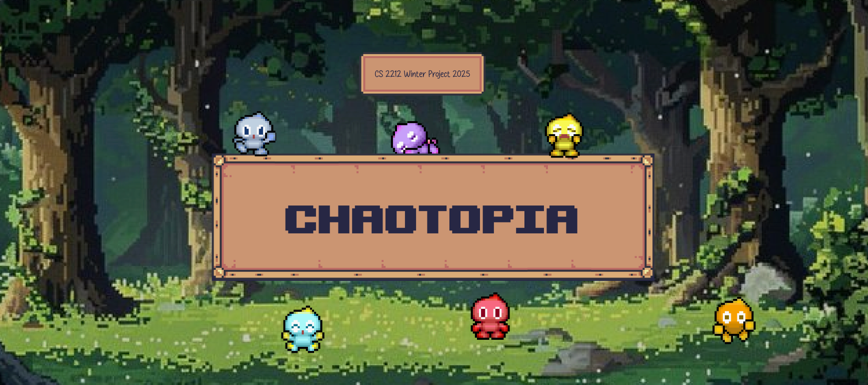

# README


- [README](#readme)
  * [Description](#description)
  * [Build Requirements](#build-requirements)
  * [To Run](#to-run)
  * [User Guide](#user-guide)
    + [Getting Started](#getting-started)
    + [Gameplay Features](#gameplay-features)
      - [Bonus](#bonus)
    + [Saving and Loading](#saving-and-loading)
    + [Parental Controls](#parental-controls)
  * [Parental Control Password](#parental-control-password)
  * [Access Parental Controls](#access-parental-controls)
  
<small><i><a href='http://ecotrust-canada.github.io/markdown-toc/'>Table of contents generated with markdown-toc</a></i></small>

## Description
Welcome to ChaoTopia! A game designed for children ages 5 and up, 
where players can take care of their very own Chao pet. 

This project is built by:
- Rosaline Scully
- Faye Mao
- Justin Rowbotham
- Isaac Wang
- Derek Xue

## Build Requirements
To run this project, you will need to have installed and configure:
- Intellij IDEA version 2024.3.4 or higher (https://www.jetbrains.com/idea/download/?section=mac)
- Java JDK 23 (https://www.oracle.com/ca-en/java/technologies/downloads/#jdk23-windows)
- JavaFX 21.0.6 [LTS] (https://gluonhq.com/products/javafx/)
- (Optional, but recommended for development): SceneBuilder 23.0.1 (https://gluonhq.com/products/scene-builder/)

This project also uses additional packages:
- Maven 3.9.9 (https://maven.apache.org/download.cgi)
- JUnit (Configured in Intellij IDEA)

## To Run
1. Ensure you have Java JDK 23 installed and configured to your path variables. Ensure the other build requirements are installed (as described in [# build-requirements](#build-requirements))
   Ensure the correct JDK (Java 23) and JavaFX SDK paths are configured:

2. Go to File > Project Structure > Project, and set the Project SDK and Language level to Java 23.

3. Go to File > Project Structure > Libraries and ensure the JavaFX SDK is added.

**To Run using Maven (Configured for JavaFX Dependencies via IntelliJ):**
1. Ensure you have Maven 3.9.9 installed.
2. After downloading JavaFX 21.0.6 and extract it to a local folder (`/Library/Java/JavaVirtualMachines/javafx-sdk-21.0.6/lib`). This path will be used when configuring JavaFX in IntelliJ.
3. Open terminal and run
```
mvn clean javafx:run
```
NOTE: You may need to update `pom.xml` based on the path of your JavaFX `.lib` file location.

**To Run Using Intellij Run Button**
1. Ensure you have JavaFX 21.0.6 downloaded and you know the file path.
2. Set up the run configuration by going to `Run` > `Edit Configurations`
3. Add `MainMenu` to the Run Configurations.
4. Under `Build and Run`, select `Modify options` and enable `VM options`
5. Add your JavaFX installation (ending in `.lib`) to your VM options using:
```
--module-path "C:\Path\To\javafx-sdk-21.0.6\lib" --add-modules javafx.controls,javafx.fxml,javafx.media
```
where your `Path\To` is the path to your JavaFX.

## User Guide

### Getting Started

1. **Launch the Game**
  - Run the program using the provided instructions (see "To Run" section).
  - The main menu will appear with options to start a new game or load an existing one.

2. **Play Game**
  - To play the game, click on the "Play" button at the main menu. This will take you to a screen with all of your saved files.
  - As a new user, click on an empty slot to start a new game
  - You can choose your Chao, in which each Chao has different personalities and characteristics. 
  - You will also be able to name your Chao (NOTE: The name cannot be changed later on).
  - A new game file will be created and saved

### Gameplay Features

These are your Chao's statistics. If ignored, your pet’s stats may drop over time. Try to maintain a balance!

- **Hunger**: Your Chao gets hungry over time. Click the food items in the inventory to keep it full and happy!
- **Health**: Taking good care of your Chao will ensure good health! If your Chao's health drops to 0, your Chao will die.
- **Sleep**: Chaos get sleepy. Use the **Sleep** button to recharge your Chao.
- **Happiness**: Your Chao's happiness will be displayed. It changes based on how well you care for it.

You are able to perform various some actions to take care of your Chao.
#### Bonus
If you feed your Chao Hero Fruit (white fruit) or Dark Fruit (black fruit), your Chao might transform!

### Saving and Loading

- Use the **"Save"** button to save your game. A note will be displayed when you save your file.
- To load your saved game, go to the Main Menu, which you will see your game saved in a specific slot.

### Parental Controls

To access the parental controls, you will need the password (see [Parental Control Password](#parental-control-password)). The parental controls allows you to:
  - Adjust the start and end allowable play time to limit access (in hh:mm:ss format)
  - Enable or disable your set play time.
  - Displays your total playtime and average playtime from all game files.
  - Allows you to reset the total playtime and average playtime.
  - Ability to revive a dead Chao


## Parental Control Password
The password to the parental control access is:
```aiignore
abc123
```

## Access Parental Controls
To access parental controls, open the program, following [# to-run](#to-run)

When the Main Menu is open, you can click on the "Parental Controls" button and enter the password (`abc123`) to access the parental controls.